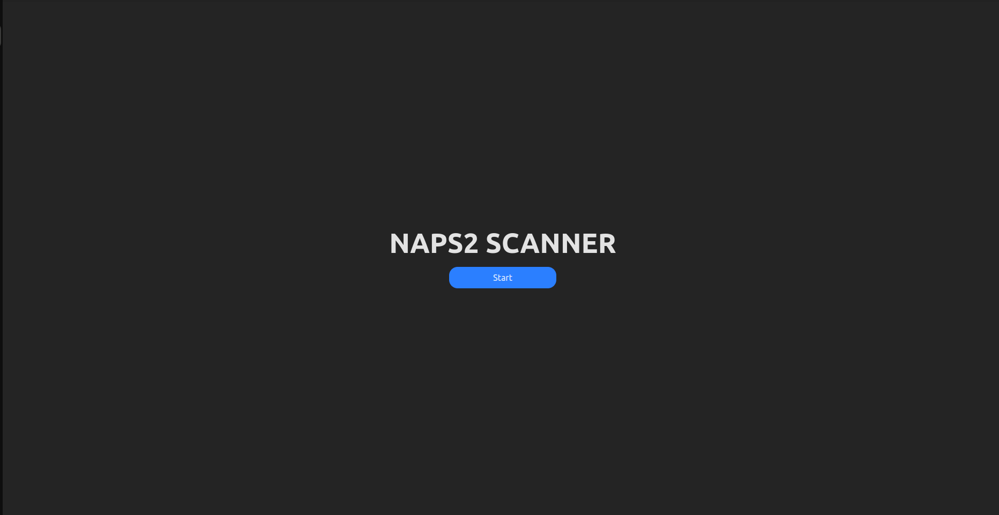
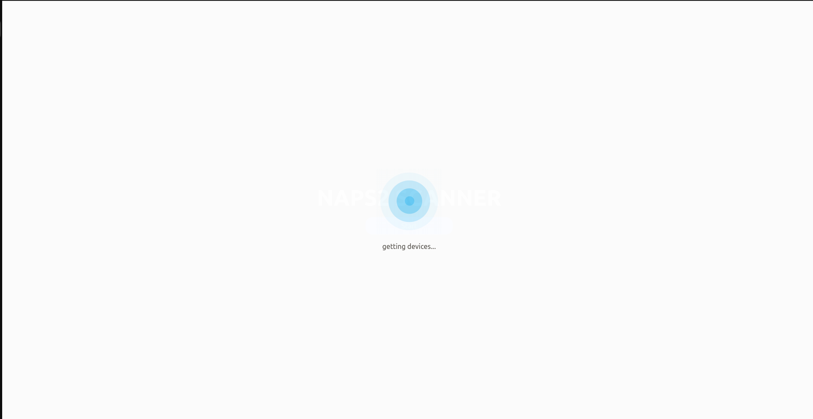
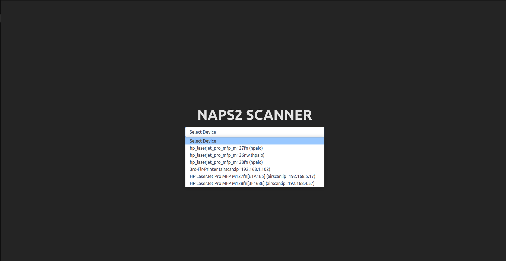
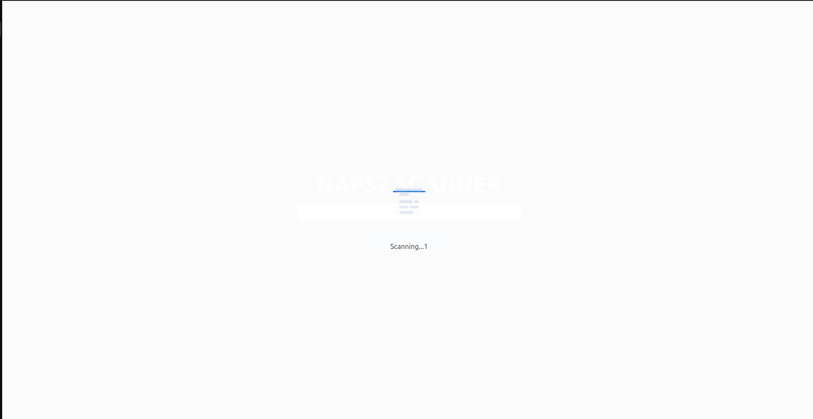
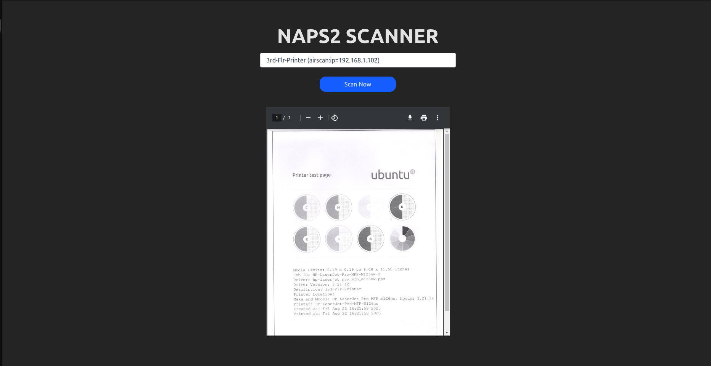

# NAPS2 + Printer Scanning App

A modern, browser-based scanning solution inspired by **NAPS2**.  
This app provides an easy-to-use **React + Tailwind** frontend with an **Express** backend that integrates directly with scanner hardware. Documents are captured, processed, and returned as **Base64-encoded PDFs**, which are displayed seamlessly inside an `<iframe>` for preview or printing.

---

## ✨ Features

- **Frontend (React + Tailwind)**

  - Clean, responsive UI with TailwindCSS
  - Document preview in an `<iframe>` (Base64 PDF rendering)
  - Option to download or print scanned PDFs
  - SDK download and setup instructions for running locally

- **Backend (Express + Hardware Integration)**
  - Communicates with scanner devices via system drivers (TWAIN/WIA on Windows, SANE on Linux, etc.)
  - Captures scans, runs optional OCR, and converts output to PDF
  - Returns Base64-encoded PDF back to frontend
  - Supports multi-page scanning and merging

---

## 📂 Project Structure

## ⚡ Getting Started

### 1. Clone repo

```bash
git clone https://github.com/rajendraradiya/NAPS2-with-Printer-Scanning-App.git
```

This will run the React frontend at http://localhost:3000.

### 2. Download SDK for interaction with hardware.

[https://www.naps2.com/](https://www.naps2.com/)

### 3. Setup Frontend

```bash
cd fronted
npm install
npm run dev
```

### 4. Setup Backend

```bash
cd backend
npm install
npm start
```

The backend will start on http://localhost:5000.

---

🔌 API Endpoints

<ul>

<li>      GET  /devices →  it's return all connected device likes printer.</li>

<li> POST /scan → Triggers scanner hardware, returns Base64-encoded PDF.. </li>

</ul>

---

## Screenshot

#### 1. Home Page



---

#### 2. Getting Device



---

#### 3. Select Device



---

#### 4. Scanning Device



---

#### 5. Rending base64 Pdf



# Generate MAC BOOK build

<pre>
naps2-service-root/
├─ usr/
│ └─ local/
│ └─ bin/
│ └─ naps2-service # your binary (chmod +x)
├─ Library/
│ └─ LaunchDaemons/
│ └─ com.example.naps2-service.plist # the service plist
└─ scripts/
├─ postinstall # executable postinstall script
└─ preinstall (optional)
</pre>

## Create the structure again

mkdir -p naps2-service-root/usr/local/bin
cp naps2-service-macos naps2-service-root/usr/local/bin/naps2-service

/Library/LaunchDaemons/com.example.naps2-service.plist

```
<?xml version="1.0" encoding="UTF-8"?>
<!DOCTYPE plist PUBLIC "-//Apple Computer//DTD PLIST 1.0//EN"
"http://www.apple.com/DTDs/PropertyList-1.0.dtd">
<plist version="1.0">
<dict>
<key>Label</key>
<string>com.example.naps2-service</string>


<key>ProgramArguments</key>
<array>
<string>/usr/local/bin/naps2-service</string>
<!-- add additional args here if needed, e.g. "--port" "5000" -->
</array>


<key>RunAtLoad</key>
<true/>


<key>KeepAlive</key>
<true/>


<key>StandardOutPath</key>
<string>/var/log/naps2-service.log</string>


<key>StandardErrorPath</key>
<string>/var/log/naps2-service.err</string>


<!-- Optional: set UserName to run as specific user (for system daemons typically root) -->
<!-- <key>UserName</key>
<string>root</string> -->
</dict>
</plist>

```

verification

sudo launchctl load /Library/LaunchDaemons/com.example.naps2-service.plist
sudo launchctl start com.example.naps2-service

## scripts/postinstall (make executable)

Place this in scripts/postinstall and mark it chmod 755.

<pre>

#!/bin/bash
set -e


# Path to installed plist (pkg installs to /Library/LaunchDaemons)
PLIST_PATH="/Library/LaunchDaemons/com.example.naps2-service.plist"


# Ensure correct ownership/permissions
if [ -f "$PLIST_PATH" ]; then
chown root:wheel "$PLIST_PATH"
chmod 644 "$PLIST_PATH"
fi


# Give the binary execute permission if it exists
if [ -f "/usr/local/bin/naps2-service" ]; then
chmod +x "/usr/local/bin/naps2-service"
fi


# Load the LaunchDaemon (safe to ignore errors non-zero on older macOS)
/bin/launchctl unload "$PLIST_PATH" 2>/dev/null || true
/bin/launchctl load "$PLIST_PATH" || true


# Start the job immediately (newer macOS might manage start automatically)
/bin/launchctl start com.example.naps2-service || true


exit 0
</pre>


## Build unsigned package first
```

pkgbuild --install-location /usr/local/bin \
 --identifier com.example.naps2-service \
 --version 1.0.0 \
 --root ./naps2-service-root \
 unsigned-naps2-service.pkg

```

 OR

```
 pkgbuild \
--root ./naps2-service-root \
--scripts ./naps2-service-root/scripts \
--identifier com.example.naps2-service \
--version 1.0.0 \
--install-location / \
./unsigned-naps2-service.pkg

```

## Sign the package

productsign --sign "Developer ID Installer: Your Name (TEAMID)" \
 unsigned-naps2-service.pkg \
 naps2-service.pkg


